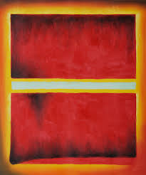

# Chromaesthesia
The creators are: Daniele Offidani, Heitor Megale and Sven Witthaus.


This is a python project where we convert colors from an image to a melody. Our objective was to simulate a type of synesthesia. Synesthesia is a sensorial condition where different senses activate each other, that is the perception of one sense leads to an involuntary perception of another sense. In our case we would be creating a reverse Chromaestesia.
Chromaestesia is a natural conditional where sounds produce the sensation of color.


On top of the programing we built a mechanical scanner that moves a camera to take multiple pictures of the image being analyzed. Each picture is transformed into three tones and the full image will sound like a music.


The code can be used independently of the scanner and it can analyze pictures in your computer or an image from your webcamera. However, in this case it would produce a individual sound since it analyzes one picture. You could modify the code to run throught multiple images and produce a song or analyze piece by piece a individual image.


Since the maping of sounds to color varies from person to person with Chrmaestesia, there is no clear pattern to follow and is thus open to artistic interpretation. is very unique and doesn't follow a pattern across the who has the condition, our task to reverse this process isn't dictated by any defined translation. Thus, we created multiple methods, each with its downsides and upsides, that we will describe later. Of course, anyone is encouraged to expand on these methods with innovative ideas that could improve the experience.

The following is an example of an image scanned in a grid of XxY and the sound output produced:

  


  

## Necessary libraries and instalation

You will need several python lybraries and programs in order to execute our project.

Apart from the conventional libraries you will need the following:

* pydub

* pygame

* pyserial

* cv2

* scipy / numpy / Matplotlib

* pyaudio

* glob

In order to visualize the colors we have implemented a function, to try to visualize the most dominant colors promted. For this, one will need the libraries:

* seaborn

* webcolors

Another aspect of our code is the GUI, which, while still in a primitive state requires installation of:

* PyQt5

Cv2 might be the trickest to install, however you can find instructions on their website https://pypi.org/project/opencv-python/ ,
while the others can be installed by running ``` pip install 'library' ``` on your python shell command prompt.

PyAudio is also, one of the libraries to be cautious of. Pyaudio is somewhat outdated, making the process of installing it tricky depending on what device you are using. Specificially, one should look into portaudio error files.

The program utilizes three folders in the directory of your choice to store the sounds that will be used during the composition.
To create this folders download the ``` Setup.py ``` script and alocate it to the directory you want he program to be ran and used.
On the script you will need to change the path to your directory's path as indicated below:

```pythonscript
#SetUp
import os
directory="C:\\Users\\heito\\Desktop\\UCSB\\Spring 2019\\15C\\Music" #<-- your directory
os.chdir(directory)
def createFolder(folder):
    try:
        if not os.path.exists(folder):
            os.makedirs(folder)
    except OSError:
        print('Error: Creating directory. ' + folder)
#createFolder('.\\test\\')

createFolder('\\FinalSong\\')
createFolder('\\FinalFolder\\')
createFolder('\\Separate_Sounds\\')
```

Once the setup is ran you will need to alocate all the following scripts to the same folder you allocated and ran ``` Setup.py ```.
 * all the code
 The role each of these scripts plays in the project is explained in their own descriptions and will also be examplified here.
 
As a demonstration, if you run ``` Programwithout_ardu.py ``` you will be asked which translation technique you want to use, chose one and it should capture an image from your webcamera and produce one sound. This sound is in reality the overlap of three tones extracted from the image, if you check your ``` SeparateSounds``` folder, you can hear each individual tone.


## Components 
 
 ### Image processing
 The sript ``` ImageAlgorithm.py``` is the responsable for analyzing the given picture.
 As a output from this script we have the three most dominant colors in RGB format(?).
 
 ### Arduino Code
 
In order to use our scanner to take multiple pictures of agiven image we need a controler for the movement. Here we wrote an arduino script named ```ControlScanner.ino``` . In this script we are controling two stepper motors through two EasyDrivers XXXX and receving information from 2 limit switches. Thus in this setup we utilize 12 pins of the Arduino. The code is structured so that it communicates with the python scipt ``` Final_with_ardu.py ```. Once the python code gives a signal for the arduino to start it will move the scanner in the x direction ultil it hits the first limit switch. Then it activate the other motor moving the scanner in the y direction ultil it hits the second limit switch. After the delimeters of the picture that will be scanned are defined the camera will move in a zig-zag shape, forming a grid. The code was built so that the camera will move to the next square only after a picture has been taken. The size of the grid can be defined in the top of the arduino code:
```cscript
int xpartitions= 3;
int ypartitions =3;
```
In the end of the motion the camera will have covered the entire picture and will return to its initial place, the arduino code will restart itself and will be ready to be used again.

### Translation to sound


### Creating a Melody

The python script ```MelodyCreator.py``` is the responsable for combining all the individual sounds into a final melody. It does that by separating the first sound file into two parts. The second part will be combined with a segment of the next sound with the same length. By doing thid=s we overlap the decay of one sound with the begging of the other, giving it a more natural sound. Notice that you can change this overlap by changing the following value:
```pythonscript
time_overlap=3*len(file_ii)/4
```
The overlap is based on the length of the file, thus if the files have the same length the end result will play at a constant bpm.

The initial part of the sound and the overlap are stiched toghether, then the process will be repeated for all sounds, being mindfull that they should start at the end of the last one.
An example of a final melody can be found below:

 

In this code we made use of the pydub lybrary to edit the sound files ina intuitive way.
### The scanner

To build the scanner we took inspiration on how 3D printers are designed, in our case a two axes system was necessary instead of three.
The skeleton of the scanner was a wooden box, large enought to house the components and to scan a sizable paper. The first motor is attached to the bottom with a belt connecting its pulley to an upper gear. This one is connected to an axel that rotates two other pulleys. Each one of those, locatted in the corner of the box, rotates a belt that will slide a pice throught a rod. This piece was designed by us and it is in the folder ``` 3d Designs``` as ```axisconnector.f3d```. Its function is to slide in one axis, pulled by the belt, while supporting the machinery that will move the second axis. We set up another axis using this two connectors, the second motor on one and a puley fixed to the other. The belt taht is moved will slide the camera house (```camera_house.f3d```), so that the camera can now cover the xy plane.


Our goal was to create a scanner that would transform an image to a song, based on its colors.
The approach we took was to develop a two axis system, powered by stepper motors that move a camera around the image. This enables us to scan images of diverse size, being only limited by the size of the box where the scanner is mounted and the chromium rods that hold the camera.
The movement of the camera is controled by an Arduino that is connected via a serial port to a Python code.
In this Python scirpt we signal the Arduino when a picture has been taken, analyze the colors in the picture, colect the 3 most dominant colors and transform each color to a specific sound. These 3 tones are then combined into a sound that is played.
After the hole image has been scaned a separe script combines all the tones captured by the camera and turns them into a melody.

