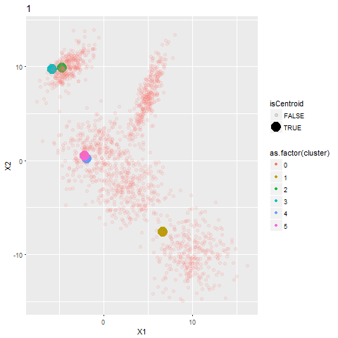

# Chromaesthesia
Developed by: Daniele Offidani, Heitor Megale and Sven Witthaus.


This is a python project where we convert colors from an image to a melody. Our objective was to simulate a type of synesthesia. Synesthesia is a sensorial condition where different senses activate each other, that is the perception of one sense leads to an involuntary perception of another sense. In our case we would be creating a reverse Chromaestesia.
Chromaestesia is a natural conditional where sounds produce the sensation of color.


On top of the programing we built a mechanical scanner that moves a camera to take multiple pictures of the image being analyzed. Each picture is transformed into three tones and the full image will sound like a music.


The code can be used independently of the scanner and it can analyze pictures in your computer or an image from your webcamera. However, in this case it would produce a individual sound since it analyzes one picture. You could modify the code to run throught multiple images and produce a song or analyze piece by piece an individual image.


Since the maping of sounds to color varies from person to person with Chrmaestesia, there is no clear pattern to follow and it is open to artistic interpretation.Because the sensation is very unique and doesn't follow a pattern across who has the condition, our task to reverse this process isn't dictated by any defined translation. Thus, we created multiple methods, each with its downsides and upsides, that we will describe later. Of course, anyone is encouraged to expand on these methods with innovative ideas that could improve the experience.

The following is an example of an image scanned in a grid of XxY and the sound output produced:

  


  

## Necessary libraries and instalation

You will need several python lybraries and programs in order to execute our project.

Apart from the conventional libraries you will need the following:

* pydub

* pygame

* pyserial

* cv2

* scipy / numpy / Matplotlib

* pyaudio

* glob

In order to visualize the colors we have implemented a function, to try to visualize the most dominant colors promted. For this, one will need the libraries:

* seaborn

* webcolors

Another aspect of our code is the GUI, which, while still in a primitive state requires installation of:

* PyQt5

Cv2 might be the trickest to install, however you can find instructions on their website https://pypi.org/project/opencv-python/ ,
while the others can be installed by running ``` pip install 'library' ``` on your python shell command prompt.

PyAudio is also, one of the libraries to be cautious of. Pyaudio is somewhat outdated, making the process of installing it tricky depending on what device you are using. Specificially, one should look into portaudio error files.

The program utilizes three folders in the directory of your choice to store the sounds that will be used during the composition.
To create this folders download the ``` Setup.py ``` script and alocate it to the directory you want he program to be ran and used.
On the script you will need to change the path to your directory's path as indicated below:

```pythonscript
import os
directory="C:\\Users\\heito\\Desktop\\UCSB\\Spring 2019\\15C\\Music" #<-- your directory
os.chdir(directory)
def createFolder(directory):
    try:
        if not os.path.exists(directory):
            os.makedirs(directory)
    except OSError:
        print('Error: Creating directory. ' + directory)

createFolder(os.path.join(directory,'FinalSong'))
createFolder(os.path.join(directory,'ImageFolder'))
createFolder(os.path.join(directory,'Separate_Sounds'))
```

Once the setup is ran you will need to alocate all the following scripts to the same folder you allocated and ran ``` Setup.py ```.
 * all the codes
 
 The role each of these scripts plays in the project is explained in their own descriptions and will also be examplified here.
 
As a demonstration, if you run ``` Programwithout_ardu.py ``` you will be asked which translation technique you want to use, chose one and it should capture an image from your webcamera and produce one sound. This sound is in reality the overlap of three tones extracted from the image, if you check your ``` SeparateSounds``` folder, you can hear each individual tone.


## Components 
 
 ### Image processing
 The sript ``` ImageAlgorithm.py``` is the responsable for analyzing the given picture.
 This uses the popular method of k-clustering. Interestingly enough, typically this works using coordinates, rather than colors. But, using the RGB color scheme, which can be visualized as a square, we can pretend that the coordinates are actually RGB values and distances are Pythagorean distances from each other.
 
 This works, by initially selecting some 'centroids'. Next, we can run through all other points in that image, computing the distance to the closest centroid. After this, knowing which points are attributed to what cluster, we can average the coordinates. This will find the new centroid. Now we can run the method again, by finding the distance to the newest closest cluster. If none of the points switched from the last iteration to the next, we can say that we have found an equilibrium and thus have found the 3 most dominant colors. If not, it will require a new iteration, to find a closer centroid.

Thus, after running the k-means algorithmm with the image we obtain the 3 most dominant colors of the image. We then, convert these colors to HSV (Hue-Saturation-Value), as this will work better with our idea of the color-sound algorithm. The code is generalized, so the algorithm can detect the n most dominant colors of the image by simply changing the following line:
```pythonscript
Clusters = KMeans(n_clusters=3, random_state=0).fit(points)
```
However, while it is easy to cahnge the number of colors here, the rest of our codes like the sound algorithm was designed to work with three colors. Thus one would need to generalize the rest of the code in order to do that.

The following image illustrates our procedure, where each black dot corresponds to the center of mass of each color.
 
 
 ### Arduino Code
 
In order to use our scanner to take multiple pictures of a given image we need to control the movement of the camera. Here we wrote an arduino script named ```ControlScanner.ino``` . In this script we are controling two stepper motors through two Spark Fun's EasyDrivers (https://www.sparkfun.com/products/12779) and receving information from 2 limit switches. Thus in this setup we utilize 12 pins of the Arduino. The code is structured so that it communicates with the python scipt ``` Final_with_ardu.py ```. Once the python code gives a signal for the arduino to start it will move the scanner in the x direction until it hits the first limit switch. Then it activate the other motor moving the scanner in the y direction until it hits the second limit switch. After the delimeters of the picture that will be scanned are defined the camera will move in a zig-zag shape, forming a grid. The code was built so that the camera will move to the next square only after a picture has been taken. The size of the grid can be defined in the top of the arduino code:
```cscript
int xpartitions= 3;
int ypartitions =3;
```
In the end of the motion the camera will have covered the entire picture and will return to its initial place, the arduino code will restart itself and will be ready to be used again.
To desing this code we took inspiration from the following 1 motor tutorial: https://www.brainy-bits.com/stepper-motor-with-joystick-and-limit-switches/
### Translation to sound

Since Chromesthesia is a very subjective experience, there is no “correct way” to translate colors into sounds. Hence, it makes sense to give to the user of the program a choice for the translation process. In this initial version of the program, three algorithms were implemented for sound-color conversion. The first algorithm was produced after assigning arbitrarily and in sequence various clean colors (colors with a hue multiple of 30º and 100% of saturation and volume) to clean notes (A, B, … G) and clean alterations of the same notes (A#, Gb, etc.). After having assigned each color to a frequency, the data points were run in a python program in order to find the best fitting function for translation. It turned out that a linear function was a good fit for the restricted range of one octave. 

In order to adapt this function to multiple octaves, a binning system depending on the value and saturation of the color analyzed was conceived. The first parameter that the program examines is the saturation value. If the saturation is very low (color tending to white), the program then checks the value level to determine whether the color is very dark (dark-gray scale, hence a deeper sound) or a very bright one (tending to white hence producing a higher pitch sound. If the saturation is not low enough, then the octave range for the color translation is decided only basing on the value parameter. Three ranges were implemented, corresponding to octaves starting at 110, 220 and 440 Hz frequencies. This binning system was implemented also for one of the other two conversion functions. The linear fits were modified for each octave according to new assignation between colors’ hues and clean notes (Note that since clean notes correspond to 2^(1/12) multiple increments starting at 27.5 Hz, a linear fit ranging all the audible octaves is nonsensical and extremely inaccurate).  

The second conversion method uses the fact that the notes in an octave range have frequencies of  f=f_(0 ) 2^(n/12)  where n = 1, 2, 3… and f_0 being the base frequency of the octave. The second method we implemented does not take into account the values of the volume and saturation of the analyzed color, but only its hue. In particular, since we wanted to apply the function to multiple octaves, we opted for a function that places the ends of the hue value (0º and 360º) at three octaves of difference: f_(360°)=8f_(0°) . Following the formula given above we obtained the conversion function: f=f_0 〖 2〗^(3h/360) where h is the hue value of the color analyzed.

Lastly, the third conversion method that we implemented combines characteristics of the first and second method. In particular, since given the nature of the second conversion method, same notes at different pitches, except for the most extreme ones, correspond to different colors, we chose the new function to range only on one octave. The function, therefore, has form       f=f_0  2^(h/360) .  In order to get other ranges of pitch, the trigger system used for the linear fit was applied, obtaining again 4 different octaves analyzable. Moreover, while in the first function we had to make different linear fits for different octaves, the only change that this conversion needs to work at different ranges is varying the base frequency f_0 .

### GUI

The GUI has been designed using Qt Creator. While still a prototype, this GUI mainly is used to more freely choose between what algorithm one wishes to use. In the GUI, one should press the button, which should start the Image-Sound-Arduino Algorithm, with the chosen conversion method as its principle.

Other ideas, that we yet have to implement is to implement a widget according to which the user has a free choice of what color corresponds to the lowest tone. By default, this is red, it having 0/360 Hue value. However, with this method one could choose what value corresponds to 0, by subtracting the desired Hue from 360. 

### Creating a Melody

The python script ```MelodyCreator.py``` is the responsable for combining all the individual sounds into a final melody. It does that by separating the first sound file into two parts. The second part will be combined with a segment of the next sound with the same length. By doing thid=s we overlap the decay of one sound with the begging of the other, giving it a more natural sound. Notice that you can change this overlap by changing the following value:
```pythonscript
time_overlap=3*len(file_ii)/4
```
The overlap is based on the length of the file, thus if the files have the same length the end result will play at a constant bpm.

The initial part of the sound and the overlap are stiched toghether, then the process will be repeated for all sounds, being mindfull that they should start at the end of the last one.
An example of a final melody can be found below:

 

In this code we made use of the pydub lybrary to edit the sound files ina intuitive way.
### The scanner

To build the scanner we took inspiration on how 3D printers are designed, in our case a two axes system was necessary instead of three.
The skeleton of the scanner was a wooden box, large enought to house the components and to scan a sizable paper. The first motor is attached to the bottom with a belt connecting its pulley to an upper gear. This one is connected to an axel that rotates two other pulleys. Each one of those, locatted in the corner of the box, rotates a belt that will slide a pice throught a rod. This piece was designed by us and it is in the folder ``` 3d Designs``` as ```axisconnector.f3d```. Its function is to slide in one axis, pulled by the belt, while supporting the machinery that will move the second axis. We set up another axis using this two connectors, the second motor on one and a puley fixed to the other. The belt taht is moved will slide the camera house (```camera_house.f3d```), so that the camera can now cover the xy plane.


## Motivation and importance

Our project came from the idea to create a tool for artists and musicians to seek inspiration on other sources. The translation of colors to sound at a ceartain point in our project became the main theme, the possibilities were multiple and the ones we settled on served our porporse.
Similar technologies of translation of visual information to sound have been used by Doctor Amedi's lab (https://www.brainvisionrehab.com/) to create a device that translates distance into different sounds. By doing this the group has helped blind individuals avoid head collisions with objects and better slef locate themselves.
Here, our project could be used to help colorblind and blind individuals to experience the difference between colors, by translating those to heaaring information.


## Future directions

Our project can be further developed, this is partially why we are posting it here so other people can build on top of what we have done.
Some ideas we had, but didn't have time to implement were: 
Modifying the sound algorithm to produce sounds that more closely resemble instruments, by adding a attack time, a hold time and utilize other periodic functions instead of pure sine waves, like saw shape function.
Develop other translation methods.
Increase the speed of the sound generation and come to closer to a real time translation.


Our goal was to create a scanner that would transform an image to a song, based on its colors.
The approach we took was to develop a two axis system, powered by stepper motors that move a camera around the image. This enables us to scan images of diverse size, being only limited by the size of the box where the scanner is mounted and the chromium rods that hold the camera.
The movement of the camera is controled by an Arduino that is connected via a serial port to a Python code.
In this Python scirpt we signal the Arduino when a picture has been taken, analyze the colors in the picture, colect the 3 most dominant colors and transform each color to a specific sound. These 3 tones are then combined into a sound that is played.
After the hole image has been scaned a separe script combines all the tones captured by the camera and turns them into a melody.

