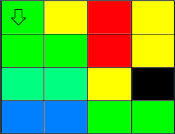

# Chromaesthesia
Developed by: Daniele Offidani, Heitor Megale and Sven Witthaus.


This is a python project where we convert colors from an image to a melody. Our objective was to simulate a type of synesthesia. Synesthesia is a sensorial condition where different senses activate each other, that is the perception of one sense leads to an involuntary perception of another sense. Examples of synesthesia include Mirror-touch synesthesia or Auditory - Tactile synesthesia. We however, focused on Chromaesthesia, the natural condition where sounds produce a sensation of color. Specifically we have tried to replicate reverse synesthesia, that is the conversion of image to color.

On top of the programing we built a mechanical scanner that moves a camera to take multiple pictures of the image being analyzed. Each picture is transformed into three tones and the full image will sound like a music.

The code can be used independently of the scanner and it can analyze pictures in your computer or an image from your computer camera. However, in this case it would produce a individual sound since it analyzes one picture. You could modify the code to run through multiple images and produce a song or analyze piece by piece an individual image.

Since the mapping of sounds to color varies from person to person with Chromaesthesia, there is no clear pattern to follow and it is open to artistic interpretation. Because the sensation is very unique and doesn't follow a pattern across who has the condition, our task to reverse this process isn't dictated by any defined translation. Thus, we created multiple methods, each with its downsides and upsides, that we will describe later. Of course, anyone is encouraged to expand on these methods with innovative ideas that could improve the experience.
    
The following is an example of an image scanned in a grid of 4x6 and the sound output produced:

<p align="center">
  
</p>


Painting: Saffron, 1957, by Mark Rothko

## Motivation and importance

Our project came from the idea to create a platform for artists and musicians to explore different sounds in relation to different images. A vital part of our project is the image to sound translation. While we have found multiple ways to transform images to sounds, as written above, we encourage the reader to come up with their own unique and creative new methods of translation.

Inspiration for this project included the works of Jay Alan Zimmerman, who has shown to replicate a version of Chromaesthesia. He employed machine learning in order for the colors to look unique while retaining the principal information of the sound. His work can be found at https://experiments.withgoogle.com/seeing-music.

Similar technologies of translation of visual information to sound have been used by Doctor Amedi's lab (https://www.brainvisionrehab.com/) to create a device that translates distance into different sounds. By doing this the group has helped blind individuals avoid head collisions with objects and better self locate themselves.

Here, our project could be used to help colorblind and blind individuals to experience the difference between colors. By attaching certain colors to certain sounds, certainly anyone could therby distinguish between any number of colors.


## Necessary libraries and instalation

You will need several python lybraries and programs in order to execute our project.

Apart from the conventional libraries you will need the following:

* pydub

* pygame

* pyserial

* cv2

* scipy / numpy / Matplotlib

* pyaudio

* glob

* sklearn

Another aspect of our code is the GUI, which, while still in a primitive state requires installation of:

* PyQt5

Cv2 might be the trickest to install, however you can find instructions on their website https://pypi.org/project/opencv-python/ ,
while the others can be installed by running ``` pip install 'library' ``` on your python shell command prompt.

PyAudio is also one of the libraries to be cautious of. Pyaudio is somewhat outdated, making the process of installing it tricky depending on what device you are using. Specificially, one should look into portaudio error files.

The program utilizes three folders in the directory of your choice to store the sounds that will be used during the composition.
To create this folders download the ``` Setup.py ``` script and alocate it to the directory you want he program to be ran and used.
On the script you will need to change the path to your directory's path as indicated below:

```pythonscript
import os
directory="C:\\Users\\heito\\Desktop\\UCSB\\Spring 2019\\15C\\Music" #<-- your directory
os.chdir(directory)
def createFolder(directory):
    try:
        if not os.path.exists(directory):
            os.makedirs(directory)
    except OSError:
        print('Error: Creating directory. ' + directory)

createFolder(os.path.join(directory,'FinalSong'))
createFolder(os.path.join(directory,'ImageFolder'))
createFolder(os.path.join(directory,'Separate_Sounds'))
```

Once the setup is ran you will need to alocate all the following scripts to the same folder you allocated and ran ``` Setup.py ```.
 * all the codes
 
 The role each of these scripts plays in the project is explained in their own descriptions and will also be examplified here.
 
As a demonstration, if you run ``` MainScript_NoArdu.py ``` you will be asked which translation technique you want to use, chose one and it should capture an image from your webcamera and produce one sound. This sound is in reality the overlap of three tones extracted from the image, if you check your ``` SeparateSounds``` folder, you can hear each individual tone.
You can change the number of images taken by editing the following line:

```pythonscript
Images=1
```
One could modify the code to extract an image from a folder instead of taking it. However, be mindful that the algorithm will create only one sound (three notes) per image. 


## Components 
 
 ### Image processing
 The script ``` ImageAlgorithm.py``` is the responsable for analyzing the given picture.
 This uses the popular method of k-clustering. Interestingly enough, typically this works using coordinates, rather than colors. But, using the RGB color scheme, which can be visualized as a square, we can pretend that the coordinates are actually RGB values and distances are Pythagorean distances from each other.
This works, by initially selecting some 'centroids'. Next, we can run through all other points in that image, computing the RGB distance to the closest centroid. After this, knowing which points are attributed to what cluster, we can average the coordinates. This will find the new centroid. Now we can run the method again, by finding the distance to the newest closest cluster. If none of the points switched from the last iteration to the next, we can say that we have found an equilibrium and thus have found the 3 most dominant colors. If not, it will require a new iteration, to find a closer centroid.
Thus, after running the k-means algorithm with the image we obtain the 3 most dominant colors of the image. We then, convert these colors to HSV (Hue-Saturation-Value), as this will work better with our idea of the color-sound algorithm. The code is generalized, so the algorithm can detect the n most dominant colors of the image by simply changing the following line:

```pythonscript

Clusters = KMeans(n_clusters=3, random_state=0).fit(points)
```

However, while it is easy to change the number of colors here, the rest of our codes, like the sound algorithm, was designed to work with three colors. Thus one would need to generalize the rest of the code in order to do that.
The following gif illustrates our procedure, where each large dot corresponds to the center of mass of the clusters, and just like in our algorithm the centers get more exact

<p align="center">
  
</p>

 Image from: http://enhancedatascience.com/2017/10/24/machine-learning-explained-kmeans/
 
 ### Arduino Code
 
In order to use our scanner to take multiple pictures of a given image we need to control the movement of the camera. Here we wrote an Arduino script named ```ControlScanner.ino``` . In this script we are controlling two stepper motors through two Spark Fun's EasyDrivers (https://www.sparkfun.com/products/12779) and receiving information from 2 limit switches. Thus in this setup we utilize 12 pins of the Arduino. The code is structured so that it communicates with the python script ``` Final_with_ardu.py ```. Once the python code gives a signal for the Arduino to start it will move the scanner in the x direction until it hits the first limit switch. Then it activate the other motor moving the scanner in the y direction until it hits the second limit switch. After the delimiters of the picture that will be scanned are defined the camera will move in a zig-zag shape, forming a grid. The code was built so that the camera will move to the next square only after a picture has been taken. The size of the grid can be defined in the top of the Arduino code:
```cscript
int xpartitions= 3;
int ypartitions =3;
```
In the end of the motion the camera will have covered the entire picture and will return to its initial place, the Arduino code will restart itself and will be ready to be used again.
To design this code we took inspiration from the following 1 motor tutorial: https://www.brainy-bits.com/stepper-motor-with-joystick-and-limit-switches/


### Translation to sound

Since Chromesthesia is a very subjective experience, there is no "correct" way to translate colors into sounds. Hence, it makes sense to give the user a choice for the translation process. In this initial version of the program, three algorithms were implemented for sound-color conversion. The first algorithm was produced after assigning arbitrarily and in sequence various clean colors (colors with a hue multiple of 30º and 100% of saturation and volume) to clean notes (A, B, … G) and clean alterations of the same notes (A#, Gb, etc.). After having assigned each color to a frequency, the data points were run in a python program in order to find the best fitting function for translation. It turned out that a linear function was a good fit for the restricted range of one octave. This method is found in the GUI under 'Linear Algorithm'.

In order to adapt this function to multiple octaves, a threshold system designed to take into account the values and saturations of the analyzed colors was conceived. The first parameter that the program examines is the saturation value. If the saturation is very low (color tending to white), the program then checks the value level to determine whether the color is very dark (dark-gray scale, hence a deeper sound) or a very bright one (tending to white hence producing a higher pitch sound. If the saturation is not low enough, then the octave range for the color translation is decided only basing on the value parameter. Three ranges were implemented, corresponding to octaves starting at 110, 220 and 440 Hz frequencies. This binning system was implemented also for one of the other two conversion functions. The linear fits were modified for each octave according to new assignation between colors’ hues and clean notes (Note that since clean notes correspond to 2^(1/12) multiple increments starting at 27.5 Hz, a linear fit ranging all the audible octaves is nonsensical and extremely inaccurate). While this discrete way may look artificial to some, it has proven to be a very favorable algorithm, producing pleasurable notes.

The second conversion method uses the fact that the notes in an octave range have frequencies of   

where n = 1, 2, 3… and f_0 being the base frequency of the octave. The second method we implemented does not take into account the values of the volume and saturation for the conversion to frequency of the analyzed color, but rather, only its hue. In particular, since we wanted to apply the function to multiple octaves, we opted for a function that places the ends of the hue value (0º and 360º) at three octaves of difference: 

Following the formula given above we obtained the conversion function: 

where H is the hue value of the color analyzed. While this algorithm is very clean in nature, a disadvantage is its repetitiveness, producing very similar sounds frequently.

Lastly, the third conversion method that we implemented combines characteristics of the first and second method. In particular, since given the nature of the second conversion method, same notes at different pitches, except for the most extreme ones, correspond to different colors, we chose the new function to range over a single octave. The function, therefore, has form:

In order to get other ranges of pitch, the trigger system used for the linear fit was applied, obtaining again 4 different octaves analyzable. Moreover, while in the first function we had to make different linear fits for different octaves, the only change that this conversion needs to work at different ranges is varying the base frequency f_0. This algorithm was chosen to be the most favorable, as it consistently produced nice sounds, while also being very intuitive in nature.


### Sound Algorithm

The Sound Algorithm was designed for the user to input 3 different edited colors, that is 3 frequencies, 3 stretch factors and 3 volumes. These values then will generate a note using these three parameters in unison as output. This script has been saved as ```FINALAUDIO.py```

More specifically, the program mainly consist of a 'Sound' function, that will generate the desired sound, which the main algorithm will then thread together to create a unison sound. The Sound Algorithm uses a method called Karplus-Strong method, which is a popular technique in digital sound creation, that creates pleasant sound and still being very cheap. A detailed description of the algorithm is listed in the paper: 'Digital Synthesis of Plucked-String and Drum Timbres' (Karplus-Strong, 1983)


Generally, this method creates a wavetable, that is inversely proportional to the frequency desired. Knowing the size, the algorithm can then create a list of numbers randomly distributed between -1 and 1. This table is then subjected to the Karplus-strong algorithm. The simplest version of the Karplus-strong algorithm will run through the entire series of points that make up the wave, and for each of them, it will average the current point with the last point of the sample. Surprisingly such an easy algorithm, will create pleasing sounds. However, as there are a lot of points in the sample, the wave will decay very quickly, thus making only very short sounds.


A more complex version of this algorithm and the one we will use is, the 'decay Karplus-strong algorithm'. This employs what is called a stretch factor: Instead of averaging every point with the last one, it will only do so with a probability of 1/stretch_factor, which has to be at least bigger than 1. This allows for much longer sounds, that are still very pleasant to listen to. Interestingly, by changing the stretch factor, we also somewhat change the timbre of the sound produced, giving a great variety of freedom for the production of sound.

Below is a sample of C major created with this sound algorithm with the same stretch factors:


On top of the Karplus-Strong method, we also developed another sound function, a saw shape sound. This sound is performed by the code ```Sawsound.py```, here the sound is the combination of three sine waves with frequencies separated by two pi, this was prefered over the complete saw wave sound since it is more natural and has a more plesing sound.
This code, however, doesn't work with three colors. We used this sound when we scanned images that had one color per image. This type of image will be futher explained in the "Reverse Translation" section. In this code we used the saturation of the color as proportional to the decay that we added multiplying the saw wave by an exponential function. Here the volume will be also proportional to the value of the color.

Below is a sample of C created with this sound algorithm with the same stretch factors:


### GUI

The GUI has been designed using Qt Creator. While still a prototype, this GUI is manly used to more freely choose between what algorithm one wishes to use. In the GUI, one should press the button, which should start the Image-Sound-Arduino Algorithm, with the chosen conversion method as its principle.


Another aspect of the GUI is its color wheel. This was implemented in order for the user to select which color should be considered as the base tone. By default, according to HSV color model, this is red (0 Hue). However, using this, we can 'rotate' the color wheel, so that any color the user selects can be considered the base color. We do this, by subtracting any Hue value the image analyzes from the selected Hue value and selecting this, as the new color for the Sound Algorithm to analyze. In case that this subtraction is negative, it will be subtracted from 360 instead. Something similar is done with the Saturation and Value parameters.


An image of the GUI is shown below:

<p align="center">
  
</p>

### Creating a Melody

The python script ```MelodyCreator.py``` is the responsible for combining all the individual sounds into a final melody. It does that by separating the first sound file into two parts. The second part will be combined with a segment of the next sound with the same length. By doing this we overlap the decay of one sound with the begging of the other, giving it a more natural sound. Notice that you can change this overlap by changing the following value:
```pythonscript
time_overlap=3*len(file_ii)/4
```
The overlap is based on the length of the file, thus if the files have the same length the end result will play at a constant bpm.
The initial part of the sound and the overlap are stitched together, then the process will be repeated for all sounds, being mindful that they should start at the end of the last one.

All examples in the sections bellow were created utilizing this method.

In this code we made use of the pydub library to edit the sound files in an intuitive way


### Reverse Translation

In order for us to understand sound translation better, we have decided to try to reverse the sound algorithm, in order to create images for some popular music. Since our melody algorithm does not allow for complex rhythms, we have decided to go for songs, with relatively uniform sound. We have decided to use Beethoven's Ode to Joy. Thus, by reversing the algorithms and scanning the resulting image, we were able to produce the following audio:

 




As one can hear, these sounds were not perfect pitch. This is most likely due to systematic imperfections in our setup, such as the camera resolution or the printing method.

### The Scanner

To build the scanner we took inspiration on how 3D printers are designed, in our case a two axes system was necessary instead of three.
The skeleton of the scanner was a wooden box, large enough to house the components and to scan a sizable paper. The first motor is attached to the bottom with a belt connecting its pulley to an upper gear. This one is connected to an axel that rotates two other pulleys. Each one of those, located in the corner of the box, rotates a belt that will slide a piece through a rod. This piece was designed by us and it is in the folder ``` 3d Designs``` as ```axisconnector.f3d```. Its function is to slide in one axis, pulled by the belt, while supporting the machinery that will move the second axis. We set up another axis using this two connectors, the second motor on one and a pulley fixed to the other. The belt that is moved will slide the camera house (```camera_house.f3d```), so that the camera can now cover the xy plane.

Below is a picture of our computer aided design, where it is possible to see where the 3D printed parts are supposed to go. This design has the spaces for the parts that we bought, like the rods and bearings, but those are not shown since we didn't need to manufacture them.

<p align="center">
  
</p>


## Results

To exemplify what we were able to accomplish utilizing this scanner and the multiple sound algorithms we show here some results.

To compare the three different translation algorithms we have the image bellow scanned in the same grid using each of this translation methods, here the arrow indicates the direction we scanned, from red to blue:

<p align="center">
  
</p>


 


As we can notice the sounds are similar, but the exponential with thresholds the higher pitch notes are more noticle since the thresholds shifts some of the colors to those notes.

We also utilized bith the exponential with and without thresholds to the following image:

<p align="center">
  
</p>

Image from: https://designwrld.com/oil-finger-paintings-iris-scott/ by Iris Scott.


Here the higher notes will correspond to the blue background, while the lower notes represents the figure in the center and also the bottom of the picture.

## Future directions

While we are proud of the development of our project in this short amount of time, we admit that there are a lot of things that can still be achieved in this project. We encourage the reader to use this code to develop their own methods of translation and code to improve the experience to be had when listening to image-processed sound.
Specifically, some ideas we had but due to lack of time couldn't fully implement were:

Specifically, some ideas we had but due to lack of time couldn't fully implement were:

 * Modifying the sound algorithm to produce sounds that more closely resemble instruments, by adding a attack time and a sustain time.
 
 * Rather than using the Karplus-Strong Algorithm, utilize other periodic functions.

 * Develop other translation methods.

 * Increase the speed of the sound generation, thus coming closer to real time translation.
 
 * Automize the Reverse Algorithm to create pictures with a given sound
 
 * Use the saturation and value of the colors analyzed to produced different sounds, rather than relying solely on the Hue

In conclusion, this project has been very fulfilling to see coming to fruition. We were able to complete our goal of creating sounds that relate to the image, and even made some interesting additions like reversing our algorithm to see what picture we should expect to make good sound. 

We hope any reader will feel inspired to look more profoundly at the codes at hand and explore all the possibilities to be had with this project. We are still very excited with this project and are determined to continue working on it to try to implement some of the interesting new features listed above. 


Our goal was to create a scanner that would transform an image to a song, based on its colors.
The approach we took was to develop a two axis system, powered by stepper motors that move a camera around the image. This enables us to scan images of diverse size, being only limited by the size of the box where the scanner is mounted and the chromium rods that hold the camera.
The movement of the camera is controled by an Arduino that is connected via a serial port to a Python code.
In this Python scirpt we signal the Arduino when a picture has been taken, analyze the colors in the picture, colect the 3 most dominant colors and transform each color to a specific sound. These 3 tones are then combined into a sound that is played.
After the hole image has been scaned a separe script combines all the tones captured by the camera and turns them into a melody.

